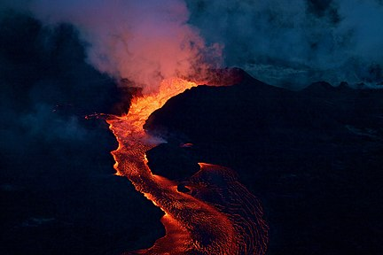
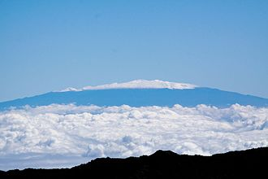

# Volcanoes
Volcanoes are places in the Earth where the crust is not connected, so that there is a direct channel to the mantle. Because of this, magma flows from the mantle to the opening, shaping chambers and coming out as lava. Volcanoes are generally found at plate boundaries, where the crust is not connected. 

## Types of volcanoes
When magma erupts to the surface as lava, volcanoes can form depending on the stickiness of the magma, the amount of gas contained within it, its composition, or the way it reached the surface. The two primary forms of volcanoes created from this are stratovolcano and shield volcanoes, though many volcanic features can accompany them, such as cinder cones or lava domes.

### Shield Volcanoes
Volcanoes that produce low viscosity or runny lava have currents that spread far from their source, creating gentle slopes. Repeated eruptions of this result in a steady accumulation of magma sheets, building a distinctive form. These are classified as shield volcanoes, as the fluid basaltic lava flows give its shape a smooth shield-like appearance that resembles a warrior's shield lying on the ground. In consequence of its magmatic composition, shield volcanoes diffuse activity for long periods when they are active, resulting in the slow formation of edifices that can reach enormous dimensions. This causes mature shield volcanoes to be the largest volcanic features on Earth. A notable example of this is the Mauna Loa, stretching 4,169 metres above sea level and over 100 kilometres wide at its base.

### Stratovolcanoes
Stratovolcanoes, or composite volcanoes, are conical volcanoes built up by many layers of hardened lava and tephra, causing steep slopes. These volcanoes are shaped from viscous, sticky lava as opposed to runny lava. The volcano follows periodic intervals of explosive and effusive eruptions, where a magma chamber 5-10 kilometres below the vent releases an overflow of pressurised gas. The released flowing lava will cool and harden before spreading far due to its high viscosity, causing a bulging apex. An example of a stratovolcano is Mount Pinatubo, with an eruption that caused deaths and considerable local damage in the historic past. Its bursts released aerosols around the world; deploying 22 million tonnes of toxic gas into the stratosphere. As of now, stratovolcanoes only exist on Earth.

## How volcanoes are formed
Volcanoes are formed at subduction zones of converging or diverging tectonic plates. They do not typically occur at transform boundaries due to there being little or no magma available at the plate boundary.

At converging boundaries, one plate will move beneath another depending on its density. The subduction will allow magma to be released into the surface, creating a bulge in the crust Ocean-ocean subduction produces an island-arc volcano and ocean-continent subduction produces Andean-type volcanoes.

On the other hand, tectonic plates move away from one another along divergent plate boundaries. The Earth's crust is being ripped apart to make room for rising hot lava to spill over the surface. Volcanoes can sometimes form in certain environments; Iceland is an example. 

Iceland is on the Mid-Atlantic Ridge, a divergent plate barrier that separates the North American and Eurasian plates. Molten rock (magma) rises and erupts as lava as the plates separate, forming a new ocean crust. There are more than 100 volcanoes on the island. Some have become extinct, but more than 30 are still alive and well. The majority of Iceland's volcanism occurs along volcanic rift zones that run across the island's centre.

## How a volcano works
The rock beneath Earth's crust is not entirely solid. It has melted into a highly hot liquid known as magma in certain spots. Magma rises via a crack in the crust and becomes trapped in a magma chamber. Pressure develops as more lava enters the chamber until it is pushed up through a pipelike vent and bursts onto the Earth's surface. The magma can be hurled into the air, splitting into billions of fragments, if the eruption is strong enough. These are available in a variety of sizes, ranging from tiny dust to huge rocks.

## Case study: Mount Kilauea 
Mount Kilauea is a volcano in the southeast of the Big Island of Hawaii. It has erupted many times, with the first eruption predating humans. the oldest exposed lava is over 2800 years old. It Kilauea is one of the most active volcanoes in the world, having erupted many times and continuing to erupt even today. It made headlines in 2019 as lava from the Hawaiian chain of volcanoes seeped towards cities. 

Mount Kilauea is a shield volcano which had been erupting continuously since 1983, finally stopping in late 2018. It poses a great threat to locals as the lava flow is incredibly hot and destroyes everything in its path. The lava, which destroyed 716 homes and engulfed much of the southeast of Hawaii's Big Island, created a new strip of land when it hit the sea. 

Mount Kilauea is incredibly active, and thus incredibly dangerous. There is the threat of the magma heating the groundwater to steam and exploding the mountain, or a buildup of dangerous gases which could suffocate local populations. It shoots runny lava which can destroy anything in its path. However, the lava cools and slows before reaching populations, so locals have plenty of time to evacuate. 

## Case study: Mauna Kea 
Mauna Kea is a volcano that is also located on Hawaii's Big Island. It is located in the north of the island, and last erupted about 6000 to 4000 years ago. It is currently given a hazard rating of 7-8, with 9 being the least dangerous. As such, Mauna Kea does not pose a significant threat to locals, and roads and settlements have been built on top of it. 

Mauna Kea is the tallest mountain in the world. In its active state, Mauna Kea was a shield volcano that spurted out runny lava, but as it began to go into dormancy, the lava became stickier, characterised by a steeper slope near the top. 

Mauna Kea's dormancy means that it is highly unlikely to pose a threat to any locals. It is unlikely to erupt in the next 100 years, although it is not extinct and will probably erupt within the next 500 years. 

## Sources
https://en.wikipedia.org/wiki/Volcano

https://www.youtube.com/watch?v=LQwZwKS9RPs

https://www.youtube.com/watch?v=hDNlu7Qf6_E

https://www.bgs.ac.uk/discovering-geology/earth-hazards/volcanoes/how-volcanoes-form/

https://en.wikipedia.org/wiki/Shield_volcano

https://en.wikipedia.org/wiki/Stratovolcano#Effects_on_climate_and_atmosphere

https://www.bgs.ac.uk/discovering-geology/earth-hazards/volcanoes/how-volcanoes-form-2/

https://www.onegeology.org/extra/kids/volcanoes.html

https://www.youtube.com/watch?v=_zeUdtx_KAI

https://www.dkfindout.com/us/earth/volcanoes/how-volcano-erupts/

https://en.wikipedia.org/wiki/Mauna_Kea